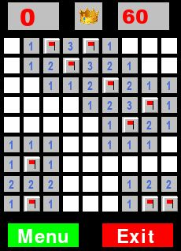

# Minesweeper by Sang Ok Suh

## Overview  
I have recreated the famous Minesweeper game with two difficuties:  
1. Easy (9x9 with 10 bombs)  

2. Hard (16x16 with 40 Bombs)  

## Game Description  
In Minesweeper, all cells are initially hidden.  
Clicking on a cell reveals its contents.  
If the cell contains a mine, then the game ends and the player loses.  
If the cell does not contain a mine, the number of adjacent cells with bombs is revealed.  
If a cell does not contain a mine, and it is not next to a mine, a blank cell is displayed and other adjacent black cells are revealed.  
The game ends when, either a mine is uncovered (loss) or all cells are revealed that do not contain a mine (win).  
First click cannot be a mine. If first click is a mine, game is restarted.  

## Algorithm Description
Every time an user makes a move (not a mine), this program loops through the board to check for winning conditions.  
The winning condition is: when there are no empty spaces left and no flags in empty positions.  
The loop through the board takes O(m*n) time.  
The number of maximum moves a user can take is m*n times because there are maximum m*n possible cells.  
Therefore, the complexity of the algorithm that verifies the solution is O(m2n2).  

## Program Instructions  
1. You cannot 
1. From the main page, click on a difficulty level.  
2. Top left shows the the number of bombs left to find.  
3. Top right shows the time counter.  
4. The middle shows the status of the game: thumbs up for on-going game, thumbs down for lose, crown for win.
5. You can click the middle icon to restart the game within the same difficulty.  
6. You can navigate to the main menu (to choose another difficulty) or quit the game using the buttons on the bottom.  

## Contents  
I have provided one file and one image folder:  

1. minesweeper.py  
2. images  

Both files have to be in the same folder to run the pygame successfully.  

## Program Instructions  
To run the game in the terminal, you need to install **pygame** if you don't have it installed.  

**From the pygame.org website:**    
The best way to install pygame is with the pip tool (which is what python uses to install packages).   
Note, this comes with python in recent versions.   
We use the --user flag to tell it to install into the home directory, rather than globally.  

	python3 -m pip install -U pygame --user  
	

After intalling pygame, you can open the game in the terminal using the following scripts (depends on your python):  
	
	py minesweeper.py  
	
	python3 minesweeper.py  
